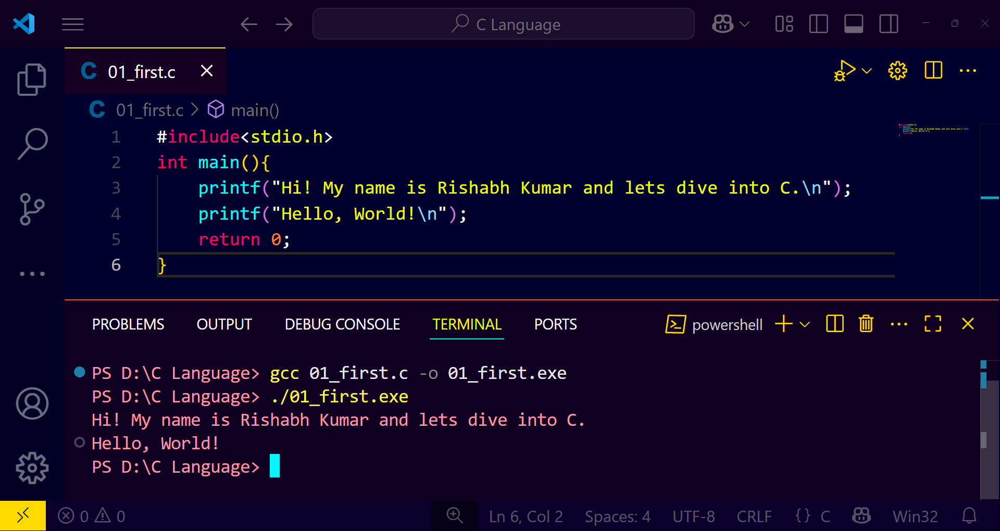

# C Program: Hello, Rishabh!

This is a simple introductory C program that prints a welcome message to the console. It’s a great starting point for anyone beginning their journey with the C programming language.

## 🧾 Source Code

```c
#include <stdio.h>

int main() {
    printf("Hi! My name is Rishabh Kumar and lets dive into C.\n");
    printf("Hello, World!\n");
    return 0;
}
```
## 🖼️ Screenshot
